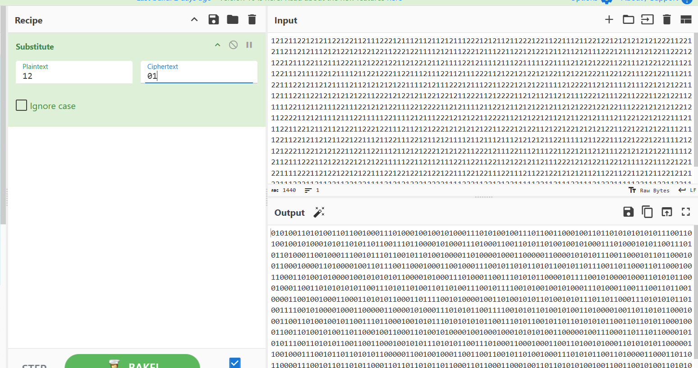
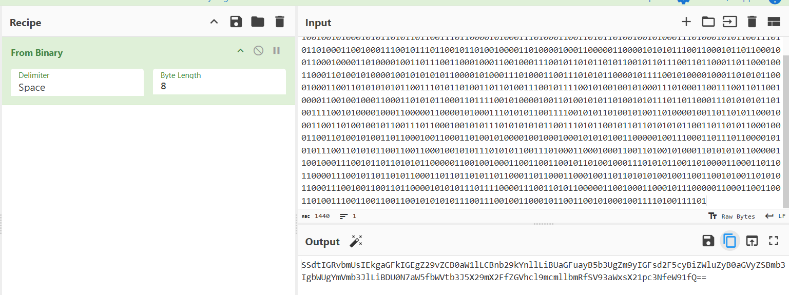
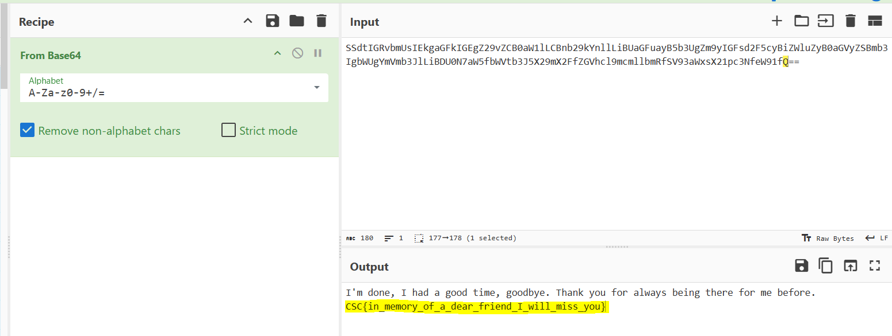

### Scénario :

*A close friend recently passed away, a note was found nearby, we would like you to figure out what it says.*

### Contenu du challenge (fichier dans lequel se trouve cette suite de 1 et de 2

```visual-basic
121211221212112212211211122212111211211212111222121211211222122112211121122122121212121212221122121121121211121212212122122112221221111212111222121112211221212212112112121112221211121212211222121221211122112111222112122212211212212112111122121111211122111112211112121212221122111212212211121122111211112212111121122122211221112111221121112221121221212212122112122122211221221112212211121122111221211212111121121212121221111212111222121112211222121212211112122221121211112111221212122111211122112212121212122112221212212112212212112221121222211212112112121112221211122112221122122112111122112112111221112212121221112212222112121111211221211212122121121212221221221112221212121221211222211212111121112211111221111212111222121212211222211212122121121211221211112112212212122111211122112212112112122112221221112112121222121212121221122212122112122122121212122112212212122111211122112212112121122122111211221112212112121111211211121112121212112211111211222111221222122111121212122211221212122112211221112112121222121212211222121112211121112211221211212111221212121221111122112111222112122122121212211111221121121112211221122112122121121112221212122112212111122111221221221111222112122122121221112212212212122122111221221112211121122122121212112112211221121211221212122111222112112211221221111212121222122221111222112212122111112211211122111212221111122111221122112212112221122112211221121212121222112221121122111212211221121211121122221211222212
```

### Résolution :

1. Déduction, on a une suite de 1 et de 2, est ce que ça ressemble à quelque chose que je connais déjà ? Oui → binaire (suite de 0 et de 1) on va donc faire de la substitution dans un premier temps en échangeant les 1 avec des 0 et les 2 avec des 1. 
Ici, je vais utiliser CyberChef pour le faire, voir capture d’écran :
    
    
    
2. Puisque c’est du binaire, je vais pouvoir essayer de voir ce que cette suite veut dire, toujours avec CyberChef, mais cette fois ces paramètres seront utilisés : 
    
    
    
3. L’Output ici présent me donne fortement l’impression qu’il s’agit d’une chaîne de caractère codée en base64 (les deux = à la fin correspondent à du “padding” en base64), je vais donc décoder cette chaîne, toujours sur CyberChef, avec les paramètres suivants : 
    
    
    

<aside>
✅

Flag : **CSC{in_memory_of_a_dear_friend_I_will_miss_you}** 

</aside>
