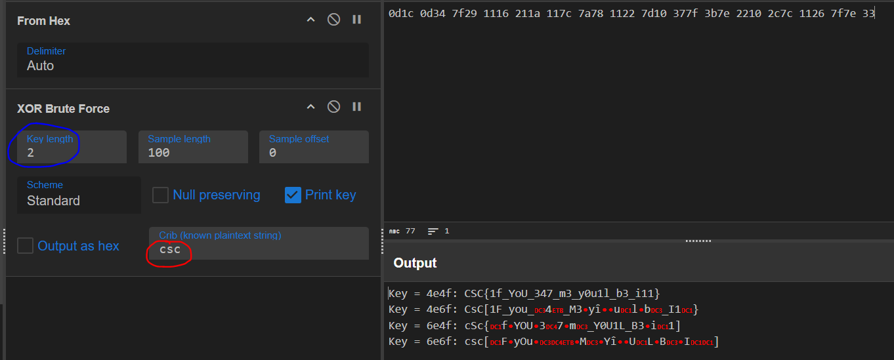

*Merci à : https://github.com/cscbe/CSCBE-2024-WRITE-UPS/tree/main/Crypto/Glutton*

### Scénario :

*Do you really want to eat that? It doesn't look like a hash brown to me.*

### Contenu du challenge :

Un fichier .bin

### Résolution :

On nous sous-entends que ce n’est probablement pas un hash “it doesn’t look like a hash brown to me” et en effet, ça n’en est pas un.

On est en cryptographie mais surtout en easy donc on va simplement essayer de déchiffrer le contenu du fichier, rappel : le chiffrement XOR est une méthode classique, rapide mais surtout facile à déchiffrer, on va donc essayer de faire du déchiffrement XOR.

D’abord, il faut récupérer le code hexadécimal de celui-ci, pour ce faire : `xxd challenge.bin` ensuite, on va essayer de décrypter ce code grâce à cyberchef, avec les paramètres suivants : 

En bleu : on mets 2 car si on ne mets qu’1, le nombre de clé utilisé n’est pas suffisant.

En rouge : un “filtre” car bcp de clés sont utilisées donc de nombreuses sorties.

<aside>
✅

Flag : **CSC{1f_YoU_347_m3_y0u1l_b3_i11}**

</aside>
