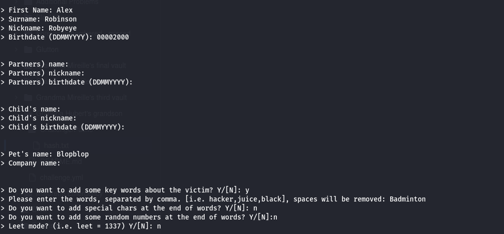
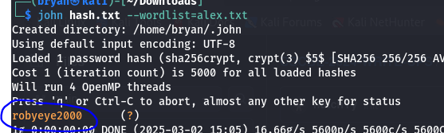

### Scénario :

*Hey everyone!*

*My grandson, Alex Robinson, asked me to write a small text for you all since you seem to enjoy our challenges. Did you know that Alex was born in the 2000s? He is still young but has already found a job. He is currently living in Anderlecht, which is quite annoying for me as it is far from my place. He doesn't come to visit me at home that often, but I'm okay with that as I have "Blopblop," my goldfish. Additionally, I sometimes go see Alex at his badminton club where his friends like to call him "Robyeye" because he always say yes for a game of badminton.*

*I hope you learned a bit more about me!*

*Regards, Grandpa Hubert*

### Contenu du challenge :

On a un fichier contenant un hash ($5$a.Aeyx04z2zs6MnE$jLqVIuKZopV//mhWlUCy2hiMAA4zLefacvOTDyhm4q/)

### Résolution :

Premièrement, on peut essayer d’identifier le hash (outil : https://hashes.com/en/tools/hash_identifier), il s’agit d’un hash SHA256 ou SHA256crypt.

Ensuite, en analysant le scénario on peut voir beaucoup de mots “clés”, ces mots clés pourraient nous aider à construire un dictionnaire de mots de passe, dont on pourrait se servir pour attaquer le hash …

C’est donc ce qu’on va faire, en premier temps, on repère les mots clés/informations intéressantes susceptibles de se retrouver dans un mot de passe faible : “Alex”, “Robinson”, “2000”, “Anderlecht”, “Blopblop”, “Robyeye” et même “Grandpa” “Hubert”.

Maintenant, il est temps de créer le dictionnaire de mot de passe, on va faire cela grâce à un outil sous linux : **cupp**

Avec la commande `cupp -i` on crée ce dictionnaire et réponds aux questions de cette manière : 

J’aurais pu rajouter des mots clés mais j’ai essayé comme ceci, un dictionnaire est donc créé “alex.txt”, on va effectuer une attaque sur le mot de passe grâce au dictionnaire et à l’outil john the ripper, avec la commande suivante : `john hash.txt --wordlist=alex.txt`

Le mot de passe trouvé est sur la capture d’écran suivante : 

<aside>
✅

Flag : **robyeye2000**

</aside>
