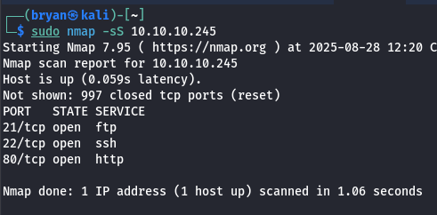
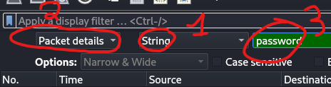
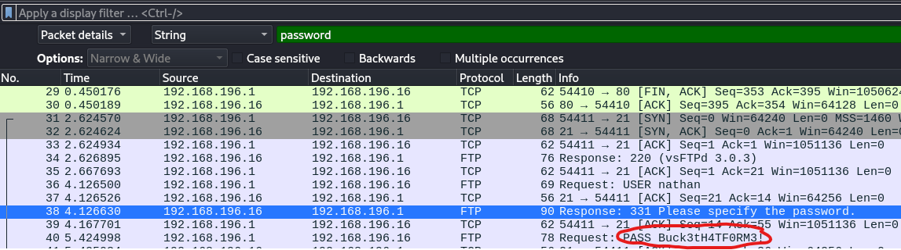
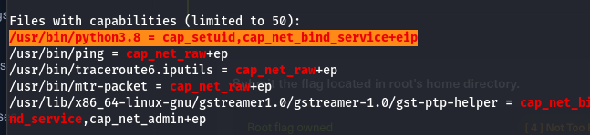

*Don’t forget to connect to the HTB’s VPN via openvpn ! If not, you won’t be able to communicate with the machine.*

# How many TCP ports are open ?

**On kali’s terminal :**

→ `sudo nmap -sS <MACHINE_IP>`

The output should be the following : 

We see that there is 3 open TCP ports.

<aside>
✅

Answer ****: **3**

</aside>

# After running a “Security Snapshot”, the browser is redirected to a path of the format `/[something]/[id]`, where `[id]` represents the id number of the scan. What is the `[something]` ?

So, as we’ve seen in our nmap scan, there are 3 services open :

- **ftp**
- **ssh**
- **http**

For this task, we are going to focus on the http service.

**On kali’s browser (e.g. brave) :**

→ Navigate to **http://<MACHINE_IP>:80** (80 is the port of the HTTP service).

→ Click on the hamburger menu, then click on “**Security Snapshot (5 Second PCAP + Analysis)”** .

→ After five seconds, you should’ve been redirected to a new page, which for me is http://10.10.10.245**/data/13,** meaning that the answer to the question is **data** !

<aside>
✅

Answer : **data**

</aside>

# Are you able to get to other user’s scans?

To see if we are able to do so, lets do this :

**On kali’s browser :**

→ Replace your ID (highlighted in red in the screenshot below) in the URL by another number (3 for example). You’ll be able to see the PCAP capture of another user

<aside>
✅

Answer : **yes**

</aside>

# What is the ID of the PCAP file that contains sensitive data?

For this step, you would have to check every ID and download every PCAP file to see if there’s any sensitive data in it (a password for example). Then find out the only ID with sensitive data is **0**, to see the sensitive data, open the PCAP with *WireShark* and :

**In WireShark :**

→ Click **Edit > Find Packet**

→ Configure it to search for **Strings** in **Packet details**, and search for “**password**”, like this :

→ Press Enter, and see for yourself! :

<aside>
✅

Answer : **0**

</aside>

# Which application layer protocol in the pcap file can the sensitive data be found in?

If we analyze the previous screenshot, we can see that the password is seen in a FTP packet.

<aside>
✅

Answer : **ftp**

</aside>

# We’ve managed to collect nathan’s FTP password. On what other service does password work?

Reminder : we have 3 services running, FTP, HTTP, and **SSH.**

Let’s try to connect to the machine via ssh, with nathan’s account and the password found before :

**On kali’s terminal :**

→ `ssh nathan@<MACHINE_IP>`, then put the password found before.

You are now connected !

<aside>
✅

Answer : **ssh**

</aside>

# Submit the flag located in the nathan user’s home directory.

**On the ssh terminal :**

→ `ls`, we see that we have a file named “user.txt” …

→ `cat user.txt`

<aside>
✅

Answer : **3a88da87769c01bf169becd1c1b2636c**

</aside>

# What is the full path to the binary on this machine that has special capabilities that can be abused to obtain root privileges?

As we have a script named “linpeas.sh” in the user’s directory, we are going to use it to find that binary. If you didn’t know, linpeas is a script/tool that check if there’s any security flaws in your system and, if there is one, report it in it’s output.

**On the ssh terminal :**

→ `./linpeas.sh`, then wait for 2-3 minutes.

Once the scan is done, we are going to search for the “**Files with capabilities”** section, because we are looking for a binary (file) that has special capabilities :

We can see a line that is highlighted, it is the binary we are searching for.

<aside>
✅

Answer : **/usr/bin/python3.8**

</aside>

# Submit the flag located in root’s home directory.

We are going to do some privilege escalation 😇

**On the ssh terminal :**

→ `/usr/bin/python3.8` to execute the binary with special capabilities.

→ Since it opened a python console, we are going to type python commands inside of this, which are : 

1. `import os` to import the OS module, it is a module that allows us to interract with the operating system the python console is running on.
2. `os.setuid(0)` to change the active UID for 0 (which is the UID for the user *root*)
3. `os.system("/bin/bash")` to run a bash shell with the UID 0.

We are now logged in as “*root*” !

→ `cd /root`

→ `cat root.txt`

<aside>
✅

Answer : **c4d0719fc6549c6774680cae109d934b**

</aside>
