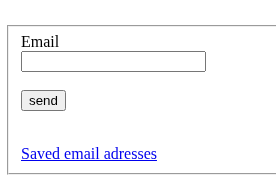
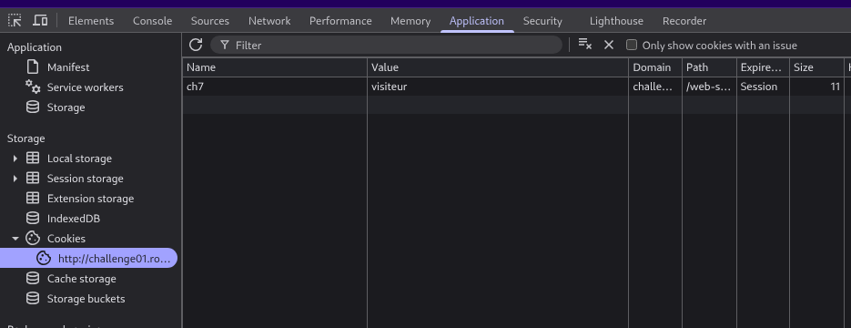

# Challenge Content

This webpage : http://challenge01.root-me.org/web-serveur/ch7/

# Challenge Resolution

When we land on the page, we see this : 

Let’s click on the **Saved email adresses** clickable text, it says “You need to be admin”, but let’s think a bit … The challenge is about cookies, so lets **Right Click > Inspect** and let’s see the cookies that we have … (in the brave’s browser it is in **Application > Storage > Cookies**).

We see this : 

Apparently, what defines our identity is the value of the cookie named “ch7”, which is “visiteur” when we first arrive on the website, but let’s change it to admin, then reload the page … Congrats, you got the password !
