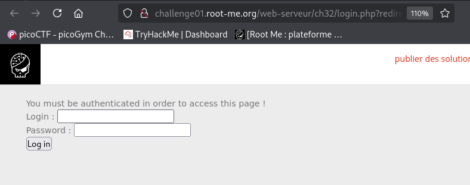
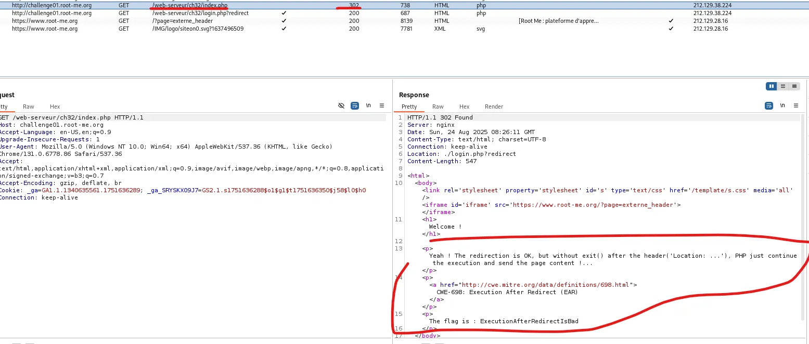

# Challenge Content

This webpage : http://challenge01.root-me.org/web-serveur/ch32/login.php?redirect

# Challenge Resolution

First of all, let’s open the webpage in our browser, it looks like this : 

Let’s try to replace the **login.php?redirect** in the URL to **index.php**, like this ****:

Then press Enter : we are redirected to login.php once again…

Now let’s think … There’s a resource associated with the challenge ([https://repository.root-me.org/Exploitation - Web/EN - Exploiting Improper Redirection in PHP Web Applications.pdf?_gl=1*jkmclg*_ga*MTU3MjgzODk4MC4xNzM5Nzg0ODMw*_ga_SRYSKX09J7*czE3NTYwMjI5ODIkbzE1JGcxJHQxNzU2MDIzNTc1JGo0NSRsMCRoMA](https://repository.root-me.org/Exploitation%20-%20Web/EN%20-%20Exploiting%20Improper%20Redirection%20in%20PHP%20Web%20Applications.pdf?_gl=1*jkmclg*_ga*MTU3MjgzODk4MC4xNzM5Nzg0ODMw*_ga_SRYSKX09J7*czE3NTYwMjI5ODIkbzE1JGcxJHQxNzU2MDIzNTc1JGo0NSRsMCRoMA)..), saying that, in some cases, the HTML source code of the restricted page is displayed in the response of the request we made. This is not a good practice of course and could be caused by the absence of the `exit()` instruction (after the “Location” header) in the response. Meaning that the page will be restricted and the user won’t be able to access it, but PHP will still execute all of the remaining code, displaying the restricted webpage content in some/most cases.

Now to exploit this, we have to intercept a request made to the index.php page with BurpSuite (since it’s a Easy difficulty challenge, you should be able to do it without me explaining it), after you’ve done that, go to **Proxy > HTTP history** (still in BurpSuite) and click on the request/response that got a **302** status code (it is the status code of a redirection), we have the flag ! : 

