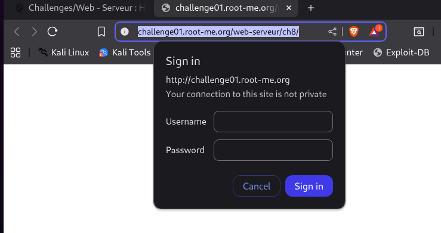
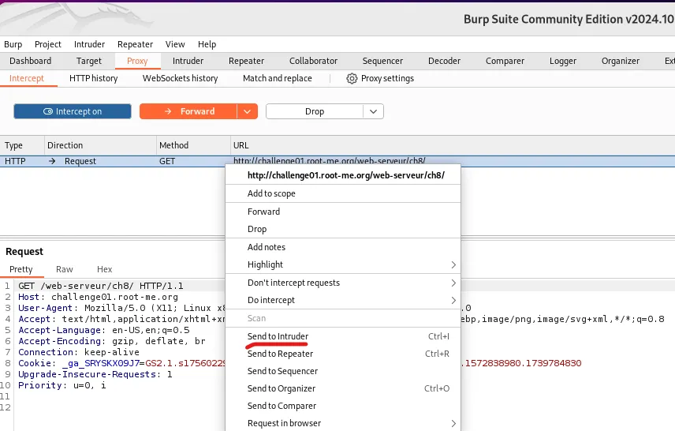
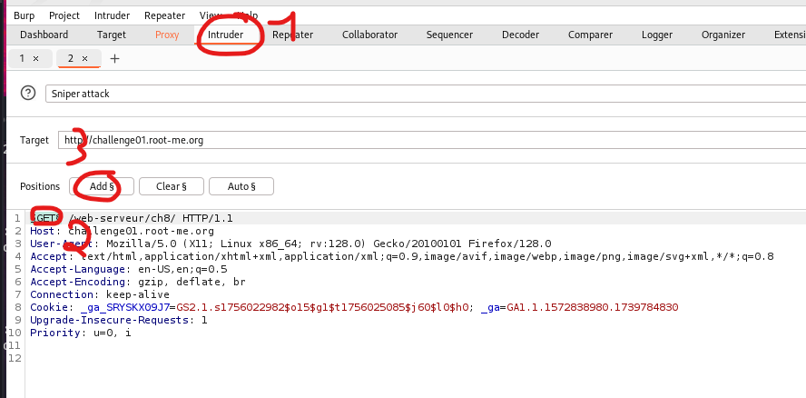
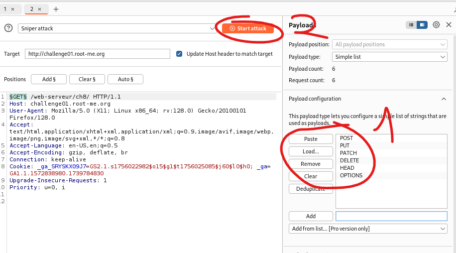
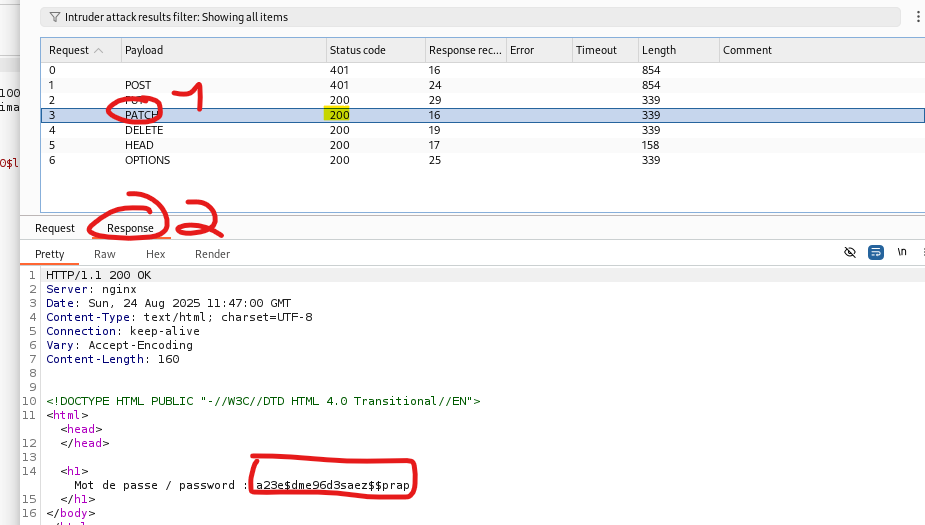

# Theoretical Notions (HTTP Verb)

**HTTP Verb :** the method designating the action that the client wants to perform

Examples of HTTP Verbs : 

- **GET** → Retrieve data from the server or transmit data to it.
- **POST** → Submit data to the server (create).
- **PUT** → Replace an existing resource with new data (update/replace).
- **PATCH** → Apply a partial modification to a resource.
- **DELETE** → Remove a resource.
- **HEAD** → Same as GET, but only return headers (no body).
- **OPTIONS** → Ask the server which methods are allowed for a resource.

# Challenge Content

This website : http://challenge01.root-me.org/web-serveur/ch8/

# Challenge Resolution

We first land on this page asking us to login : 

Since the hint given in the challenge’s description is "**Bypass the security in place”**, we should try to bypass this login form.

We are going to pay attention to the title of the challenge, which is “Verb tampering”, meaning that we should tamper the HTTP Verb (in other words : the method used to make the request). 

To do so :

- Intercept the request with BurpSuite’s **Proxy.** You may need to use and configure Firefox to use BurpSuite’s proxy, to do so, follow this link : https://portswigger.net/burp/documentation/desktop/external-browser-config/browser-config-firefox. Because using BurpSuite’s default browser didn’t work for me …
- Once it’s done, send the request to BurpSuite’s **Intruder**, by right clicking the request and then left clicking on “Send to Intruder” :

Then :

- Go to the Intruder tab (step 1)
- Select the “GET” text from the request (step 2)
- Click “Add §” (step3), this mark the string you’ve selected as a parameter that will be replaced by other strings
    
    
    

Now, still on the Intruder’s tab :

- Fill-in the Payload configuration’s list with other HTTP Verbs (step 1)
- Click the “**start attack**” button (step 2)
    
    
    

After you’ve done that, wait for 5-10 seconds, then : 

- Click on one of the request that got a **200 Status code**
- Click on **Response** to see the response to that request
- Admire the flag ! 🙂

This worked because the server’s side verification is probably done only on POST & GET method, so when we put another method, we are bypassing the login form 😄🎉
